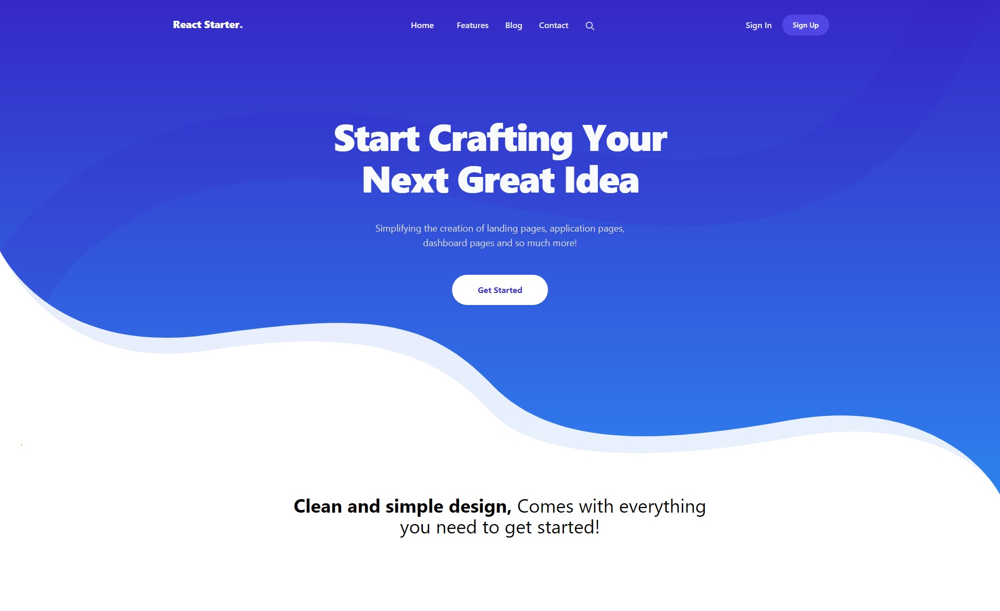

# React Starter Template

[](https://github.com/truonghungit/react-starter-template/blob/master/LICENSE)
[](https://github.com/prettier/prettier)



This is a [React](https://reactjs.org) + [TypeScript](https://www.typescriptlang.org/) starter template built with [Vite](https://vitejs.dev). We provide everything you'll need to get started building React Apps.

**Awesome thing you get _out-of-the-box_ are:**

- [ReactJS 17](https://reactjs.org)
- [Vite](https://vitejs.dev) Next Generation Frontend Tooling
- [TypeScript](https://www.typescriptlang.org)
- [React Router 6](https://reactrouter.com/) Single Page App **(SPA)** navigation
- [ESLint](https://eslint.org/) Enforce code standards
- [Browserslist](https://github.com/browserslist/browserslist) Supported browsers
- [Prettier](https://prettier.io/) Code formatting
- [Commitlint](https://commitlint.js.org)
- [Commitizen](https://github.com/commitizen/cz-cli)
- [Jest](https://jestjs.io/) Test runner
- [Testing Library](https://testing-library.com/) Test UI from a users perspective (for React and Cypress)
- [Cypress](https://www.cypress.io)
- [PULL_REQUEST_TEMPLATE](https://github.com/devonChurch/meatballs/) Consistent and helpful colabouration.

## 💻 Development

Create the project.

```bash
npx degit truonghungit/react-starter-template my-app
```

Access the project directory.

```bash
cd my-app
```

Initialize a git repository.

```bash
git init
```

Install dependencies.

```bash
yarn install
```

Start your application in local development server with hot reload at http://localhost:3000.

```bash
yarn dev
```

## 🤖 Testing

### Unit tests

Execute all unit tests

```bash
yarn test:unit
```

Execute all unit tests and collect coverage

```bash
yarn test:unit:coverage
```

### End to end testing

Run e2e tests

```bash
yarn test:e2e
```

## 🌲 Branching

We use [Trunk Based Development](https://trunkbaseddevelopment.com/) to accommodate short-lived branches and a _**"trunk"**_ _(our `master` branch)_ as a source of truth.

- **Feature: `feature/*`**

  Example: `feature/JIRA-123-my-new-feature`

- **Bug: `bugfix/*`**

  Example: `bugfix/JIRA-123-fix-an-issue`

- **Release: `release/*`**

  Example: `release/JIRA-123-brand-new-product`

## 🏆 Making Commits

We format our commit messages using [Commitizen](https://github.com/commitizen/cz-cli). This provides the project a consistent, easy structure that allows for automation opportunities.

- It is **important** that you use Commitizen when making commits

- In your **terminal** run `yarn commit` when making a commit to enter the interactive GUI.

## 💾 Pull Requests

This project has a template that sets the pull request structure that we expect from contributors.

- It is **important** to _**give**_ as much context to _**get**_ the best review from your peers.

  _(write the pull request that you would love to encounter yourself)_

- You do not have to fill out each section if it is not applicable.

## 🗜️ Merging

We always _**Squash**_ our _Pull Requests_. This makes a `cherry-pick` from `master` to a `release/*` branch when addressing a Bug Fix easy.

Make sure to _**ALWAYS**_ rebase _(not merge)_ `master` into your local branch when developing. We strive for a flat Git commit history when possible.

## Recommended VS Code extensions

- [ESLint](https://marketplace.visualstudio.com/items?itemName=dbaeumer.vscode-eslint)
- [Prettier](https://marketplace.visualstudio.com/items?itemName=esbenp.prettier-vscode)
- [Gitlens](https://marketplace.visualstudio.com/items?itemName=eamodio.gitlens)
- [Tailwind CSS](https://marketplace.visualstudio.com/items?itemName=bradlc.vscode-tailwindcss)
- [VS Code Jest](https://marketplace.visualstudio.com/items?itemName=orta.vscode-jest)

## License

This project is licensed under the MIT License.
