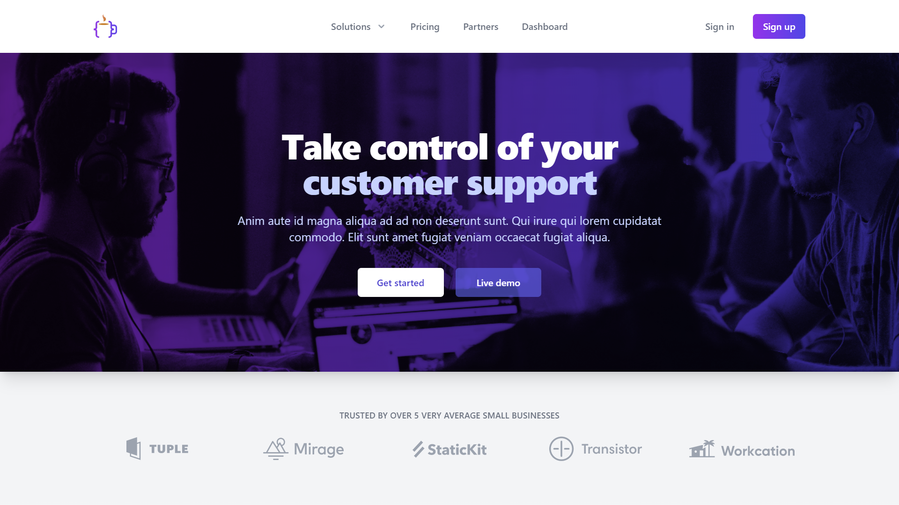

#  React Starter Template

[](https://github.com/truonghungit/react-starter-template/actions/workflows/pull-request-checks.yml)
[](https://sonarcloud.io/summary/new_code?id=truonghungit_react-starter-template)


[](https://github.com/truonghungit/react-starter-template/blob/master/LICENSE)
[](https://github.com/prettier/prettier)



This is a [React](https://reactjs.org) + [TypeScript](https://www.typescriptlang.org/) starter template built with [Vite](https://vitejs.dev). We provide everything you'll need to get started building React Apps.


#### [Live Demo](https://react-starter-template.vercel.app)
#### [Changelog](https://github.com/truonghungit/react-starter-template/blob/master/CHANGELOG.md)

## 🎯 Goals

### Get started in seconds

This starter allows you to focus on development rather than learn and configure build tools.
We've prepared the fantastic below for you.


- [Vite](https://vitejs.dev) Next Generation Frontend Tooling
- [ReactJS](https://reactjs.org) with [TypeScript](https://www.typescriptlang.org) Always update to the latest version

#### Testing
- [Jest](https://jestjs.io/) Test runner
- [Testing Library](https://testing-library.com/) Test UI from a users perspective (for React and Cypress)
- [Cypress](https://www.cypress.io)

#### Format and lint
- [ESLint](https://eslint.org/) Enforce code standards & [Prettier](https://prettier.io/) Code formatting
- [Browserslist](https://github.com/browserslist/browserslist) Supported browsers
- [Commitizen](https://github.com/commitizen/cz-cli)
- [Commitlint](https://commitlint.js.org)
- [Lint Staged](https://github.com/okonet/lint-staged)  🚫💩 slip into your code base!

#### Workflow
- Github action for pull request checks
- [Pull Request template](https://github.com/truonghungit/react-starter-template/blob/master/.github/pull_request_template.md) Consistent and helpful colabouration.

#### Library
- [React Router](https://reactrouter.com/) Single Page App **(SPA)** navigation
- TailwindCSS Integrated
- Headless ui & heroicons

#### Example pages
- Home page as landing page
- Sign In, Sign Up pages,
- Dashboard page

### Recent best practices

This repository provide an up to date example of React application following all recent best practices in various areas

## 💻 Getting started

#### Create project

Clone the latest version

```bash
git clone https://github.com/truonghungit/react-starter-template.git my-app
cd my-app
```

[Previous versions](https://github.com/truonghungit/react-starter-template/tags) are also available for download.

You can also click on **_Use this template_** on GitHub


#### Install dependencies.

```bash
yarn install
```

#### Start

Start your application in local development server with hot reload at http://localhost:3000.

```bash
yarn start
```

## 🤖 Testing

### Unit tests

Execute all unit tests

```bash
yarn test:unit
```

Execute all unit tests and collect coverage

```bash
yarn test:unit:coverage
```

### End to end testing

Run e2e tests

```bash
yarn test:e2e
```

## 😎 Make It Your Own

When using this starter project to build your own application you might consider some of the following steps:

- rename project in `package.json` `name` property and set appropriate version (eg `0.0.1` or `1.0.0`)
- delete pre-existing `CHANGELOG.md` (you will generate your own with future releases of your features)
- update the `README.md` content with your context
- edit the title and Open Graph metadata properties in `index.html`
- replace logo in `/public/images` folder
- update github workflow if you need in `.github/workflows`


## 🌲 Branching

We use [Trunk Based Development](https://trunkbaseddevelopment.com/) to accommodate short-lived branches and a _**"trunk"**_ _(our `master` branch)_ as a source of truth.

- **Feature: `feature/*`**

  Example: `feature/JIRA-123-my-new-feature`

- **Bug: `bugfix/*`**

  Example: `bugfix/JIRA-123-fix-an-issue`

- **Release: `release/*`**

  Example: `release/JIRA-123-brand-new-product`

## 🏆 Making Commits

We format our commit messages using [Commitizen](https://github.com/commitizen/cz-cli). This provides the project a consistent, easy structure that allows for automation opportunities.

- It is **important** that you use Commitizen when making commits

- In your **terminal** run `yarn commit` when making a commit to enter the interactive GUI.

## 💾 Pull Requests

This project has a template that sets the pull request structure that we expect from contributors.

- It is **important** to _**give**_ as much context to _**get**_ the best review from your peers.

  _(write the pull request that you would love to encounter yourself)_

- You do not have to fill out each section if it is not applicable.

## 🗜️ Merging

We always _**Squash**_ our _Pull Requests_. This makes a `cherry-pick` from `master` to a `release/*` branch when addressing a Bug Fix easy.

Make sure to _**ALWAYS**_ rebase _(not merge)_ `master` into your local branch when developing. We strive for a flat Git commit history when possible.

## 🧰 Recommended VS Code extensions

- [ESLint](https://marketplace.visualstudio.com/items?itemName=dbaeumer.vscode-eslint)
- [Prettier](https://marketplace.visualstudio.com/items?itemName=esbenp.prettier-vscode)
- [Gitlens](https://marketplace.visualstudio.com/items?itemName=eamodio.gitlens)
- [Tailwind CSS](https://marketplace.visualstudio.com/items?itemName=bradlc.vscode-tailwindcss)
- [VS Code Jest](https://marketplace.visualstudio.com/items?itemName=orta.vscode-jest)

## 📝 License

Copyright © 2022 truonghungit. This source code is licensed under the MIT license found in the
[LICENSE](https://github.com/truonghungit/react-starter-template/blob/master/LICENSE) file.

---

<sup>Made with ♥ by truonghungit.</sup>
